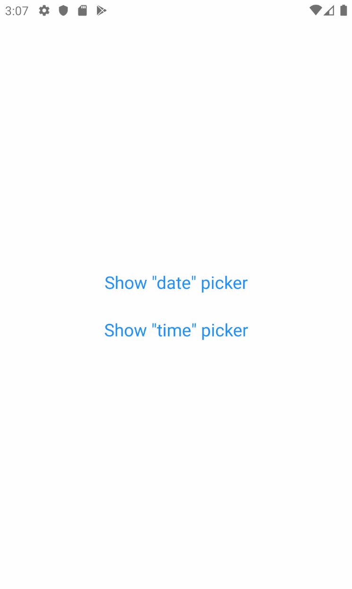
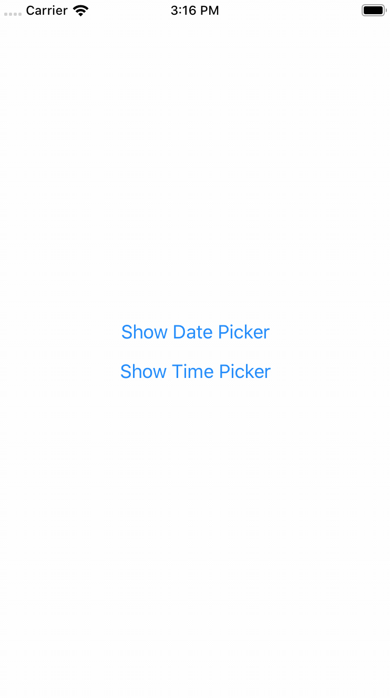
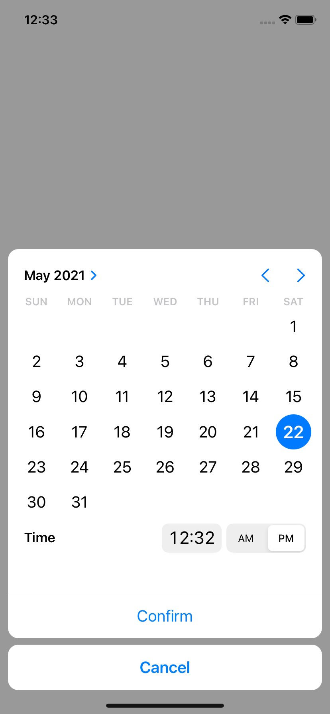

# react-native-modal-datetime-picker

[](https://badge.fury.io/js/react-native-modal-datetime-picker)


A declarative cross-platform react-native date and time picker.

<p align="center">


</p>

This library exposes a cross-platform interface for showing the native date-picker and time-picker inside a modal, providing a unified user and developer experience.

Under the hood, this library is using [`@react-native-community/datetimepicker`](https://github.com/react-native-community/react-native-datetimepicker).

## Setup (for non-Expo projects)

If your project is not using [Expo](https://expo.io/), install the library and the community date/time picker using npm or yarn:

```bash
# using npm
$ npm i react-native-modal-datetime-picker @react-native-community/datetimepicker

# using yarn
$ yarn add react-native-modal-datetime-picker @react-native-community/datetimepicker
```

Please notice that the `@react-native-community/datetimepicker` package is a native module so [**it might require manual linking**](https://github.com/react-native-community/react-native-datetimepicker#getting-started).

## Setup (for Expo projects)

If your project is using [Expo](https://expo.io/), install the library and the community date/time picker using the [Expo CLI](https://docs.expo.io/versions/latest/workflow/expo-cli/):

```bash
expo install react-native-modal-datetime-picker @react-native-community/datetimepicker
```

To ensure the picker theme respects the device theme, you should also configure the appearance styles in your `app.json` this way:

```json
{
  "expo": {
    "userInterfaceStyle": "automatic"
  }
}
```

Refer to the [Appearance](https://docs.expo.io/versions/latest/sdk/appearance/) documentation on [Expo](https://expo.io/) for more info.

## Usage

```javascript
import React, { useState } from "react";
import { Button, View } from "react-native";
import DateTimePickerModal from "react-native-modal-datetime-picker";

const Example = () => {
  const [isDatePickerVisible, setDatePickerVisibility] = useState(false);

  const showDatePicker = () => {
    setDatePickerVisibility(true);
  };

  const hideDatePicker = () => {
    setDatePickerVisibility(false);
  };

  const handleConfirm = (date) => {
    console.warn("A date has been picked: ", date);
    hideDatePicker();
  };

  return (
    <View>
      <Button title="Show Date Picker" onPress={showDatePicker} />
      <DateTimePickerModal
        isVisible={isDatePickerVisible}
        mode="date"
        onConfirm={handleConfirm}
        onCancel={hideDatePicker}
      />
    </View>
  );
};

export default Example;
```

## Available props

👉 Please notice that **all the [`@react-native-community/react-native-datetimepicker`](https://github.com/react-native-community/react-native-datetimepicker) props are supported** as well!

| Name                      | Type      | Default      | Description                                                                                                                                 |
| ------------------------- | --------- | ------------ | ------------------------------------------------------------------------------------------------------------------------------------------- |
| `buttonTextColorIOS`      | string    |              | The color of the confirm button texts (iOS)                                                                                                 |
| `backdropStyleIOS`        | style     |              | The style of the picker backdrop view style (iOS)                                                                                           |
| `cancelButtonTestID`      | string    |              | Used to locate cancel button in end-to-end tests                                                                                            |
| `cancelTextIOS`           | string    | "Cancel"     | The label of the cancel button (iOS)                                                                                                        |
| `confirmButtonTestID`     | string    |              | Used to locate confirm button in end-to-end tests                                                                                           |
| `confirmTextIOS`          | string    | "Confirm"    | The label of the confirm button (iOS)                                                                                                       |
| `customCancelButtonIOS`   | component |              | Overrides the default cancel button component (iOS)                                                                                         |
| `customConfirmButtonIOS`  | component |              | Overrides the default confirm button component (iOS)                                                                                        |
| `customHeaderIOS`         | component |              | Overrides the default header component (iOS)                                                                                                |
| `customPickerIOS`         | component |              | Overrides the default native picker component (iOS)                                                                                         |
| `date`                    | obj       | new Date()   | Initial selected date/time                                                                                                                  |
| `isVisible`               | bool      | false        | Show the datetime picker?                                                                                                                   |
| `isDarkModeEnabled`       | bool?     | undefined    | Forces the picker dark/light mode if set (otherwise fallbacks to the Appearance color scheme) (iOS)                                         |
| `modalPropsIOS`           | object    | {}           | Additional [modal](https://reactnative.dev/docs/modal) props for iOS                                                                        |
| `modalStyleIOS`           | style     |              | Style of the modal content (iOS)                                                                                                            |
| `mode`                    | string    | "date"       | Choose between "date", "time", and "datetime"                                                                                               |
| `onCancel`                | func      | **REQUIRED** | Function called on dismiss                                                                                                                  |
| `onChange`                | func      | () => null   | Function called when the date changes (with the new date as parameter).                                                                     |
| `onConfirm`               | func      | **REQUIRED** | Function called on date or time picked. It returns the date or time as a JavaScript Date object                                             |
| `onHide`                  | func      | () => null   | Called after the hide animation                                                                                                             |
| `pickerContainerStyleIOS` | style     |              | The style of the picker container (iOS)                                                                                                     |
| `pickerStyleIOS`          | style     |              | The style of the picker component wrapper (iOS)                                                                                             |
| `pickerComponentStyleIOS` | style     |              | The style applied to the actual picker component - this can be either a native iOS picker or a custom one if `customPickerIOS` was provided |

## Frequently Asked Questions

This repo is only maintained by me, and unfortunately I don't have enough time for dedicated support & question.
If you're experiencing issues, please check the FAQs below.  
For questions and support, please start [try starting a discussion](https://github.com/mmazzarolo/react-native-modal-datetime-picker/discussions) or try asking it on [StackOverflow](stackoverflow).  
⚠️ **Please use [the GitHub issues](https://github.com/mmazzarolo/react-native-modal-datetime-picker/issues) only for well-described and reproducible bugs. Question/support issues will be closed.**

### The component is not working as expected, what should I do?

Under the hood `react-native-modal-datetime-picker` uses [`@react-native-community/datetimepicker`](https://github.com/react-native-community/react-native-datetimepicker).
If you're experiencing issues, try swapping `react-native-datetime-picker` with [`@react-native-community/datetimepicker`](https://github.com/react-native-community/react-native-datetimepicker). If the issue persists, check if it has already been reported as a an issue or check the other FAQs.

### How can I show the timepicker instead of the datepicker?

Set the `mode` prop to `time`.
You can also display both the datepicker and the timepicker in one step by setting the `mode` prop to `datetime`.

### Why is the initial date not working?

Please make sure you're using the `date` props (and not the `value` one).

### Can I use the new iOS 14 style for the date/time picker?

Yes!  
You can set the `display` prop (that we'll pass down to [`react-native-datetimepicker`](https://github.com/react-native-datetimepicker/datetimepicker)) to `inline` to use the new iOS 14 picker.

<p align="center">
  
</p>

> Please notice that you should probably avoid using this new style with a time-only picker (so with `mode` set to `time`) because it doesn't suit well this use case.

### Why does the picker show up twice on Android?

This seems to be a known issue of the [`@react-native-community/datetimepicker`](https://github.com/react-native-community/datetimepicker/issues/54). Please see [this thread](https://github.com/react-native-community/datetimepicker/issues/54) for a couple of workarounds. The solution, as described in [this reply](https://github.com/react-native-datetimepicker/datetimepicker/issues/54#issuecomment-618776550) is hiding the modal, **before doing anything else**.

<details><summary><strong>Example of solution using Input + DatePicker</strong></summary>
<p>
The most common approach for solving this issue when using an <code>Input</code> is:
<ul>
  <li>Wrap your <code>Input</code> with a "<code>Pressable</code>"/<code>Button</code> (<code>TouchableWithoutFeedback</code>/<code>TouchableOpacity</code> + <code>activeOpacity={1}</code> for example)</li>
  <li>Prevent <code>Input</code> from being focused. You could set <code>editable={false}</code> too for preventing Keyboard opening</li>
  <li>Triggering your <code>hideModal()</code> callback as a first thing inside <code>onConfirm</code>/<code>onCancel</code> callback props</li>
</ul>

```jsx
const [isVisible, setVisible] = useState(false);
const [date, setDate] = useState('');

<TouchableOpacity
  activeOpaticy={1}
  onPress={() => setVisible(true)}>
  <Input
    value={value}
    editable={false} // optional
  />
</TouchableOpacity>
<DatePicker
  isVisible={isVisible}
  onConfirm={(date) => {
    setVisible(false); // <- first thing
    setValue(parseDate(date));
  }}
  onCancel={() => setVisible(false)}
/>
```

</p>
</details>

### How can I allow picking only specific dates?

You can't — [`@react-native-community/datetimepicker`](https://github.com/react-native-community/react-native-datetimepicker) doesn't allow you to do so. That said, you can allow only "range" of dates by setting a minimum and maximum date. See below for more info.

### How can I set a minimum and/or maximum date?

You can use the [`minimumDate`](https://github.com/react-native-datetimepicker/datetimepicker#minimumdate-optional) and [`maximumDate`](https://github.com/react-native-datetimepicker/datetimepicker#maximumdate-optional) props from [`@react-native-community/datetimepicker`](https://github.com/react-native-community/react-native-datetimepicker).

### How do I change the color of the Android date and time pickers?

This is more a React-Native specific question than a react-native-modal-datetime-picker one.  
See issue [#29](https://github.com/mmazzarolo/react-native-modal-datetime-picker/issues/29) and [#106](https://github.com/mmazzarolo/react-native-modal-datetime-picker/issues/106) for some solutions.

### How to set a 24-hours format in iOS?

The `is24Hour` prop is only available on Android but you can use a small hack for enabling it on iOS by setting the picker timezone to `en_GB`:

```js
<DatePicker
  mode="time"
  locale="en_GB" // Use "en_GB" here
  date={new Date()}
/>
```

### How can I change the picker language/locale?

Under the hood this library is using [`@react-native-community/datetimepicker`](https://github.com/react-native-community/react-native-datetimepicker). You can't change the language/locale from `react-native-modal-datetime-picker`. Locale/language is set at the native level, on the device itself.

### How can I set an automatic locale in iOS?

On iOS, you can set an automatic detection of the locale (`fr_FR`, `en_GB`, ...) depending on the user's device locale.
To do so, edit your `AppDelegate.m` file and add the following to `didFinishLaunchingWithOptions`.

```objc
// Force DatePicker locale to current language (for: 24h or 12h format, full day names etc...)
NSString *currentLanguage = [[NSLocale preferredLanguages] firstObject];
[[UIDatePicker appearance] setLocale:[[NSLocale alloc]initWithLocaleIdentifier:currentLanguage]];
```

### Why is the picker is not showing the right layout on iOS >= 14?

Please make sure you're on the latest version of `react-native-modal-datetime-picker` and of the [`@react-native-community/datetimepicker`](https://github.com/react-native-community/datetimepicker).
[We already closed several iOS 14 issues that were all caused by outdated/cached versions of the community datetimepicker](https://github.com/mmazzarolo/react-native-modal-datetime-picker/issues?q=%22ios+14%22).

### Why is the picker not visible/transparent on iOS?

Please make sure you're on the latest version of `react-native-modal-datetime-picker` and of [`@react-native-community/datetimepicker`](https://github.com/react-native-community/datetimepicker).
Also, double-check that the picker light/dark theme is aligned with the OS one (e.g., don't "force" a theme using `isDarkModeEnabled`).

### Why can't I show an alert after the picker has been hidden (on iOS)?

Unfortunately this is a know issue with React-Native on iOS. Even by using the `onHide` callback exposed by `react-native-modal-datetime-picker` you might not be able to show the (native) alert successfully. The only workaround that seems to work consistently for now is to wrap showing the alter in a setTimeout 😔:

```js
const handleHide = () => {
  setTimeout(() => Alert.alert("Hello"), 0);
};
```

See issue [#512](https://github.com/mmazzarolo/react-native-modal-datetime-picker/issues/512) for more info.

### Why does the date of `onConfirm` not match the picked date (on iOS)?

On iOS, clicking the "Confirm" button while the spinner is still in motion — even just _slightly_ in motion — will cause the `onConfirm` callback to return the initial date instead of the picked one. This is is a long standing iOS issue (that can happen even on native app like the iOS calendar) and there's no failproof way to fix it on the JavaScript side.  
See [this GitHub gist](https://gist.github.com/SudoPlz/6959001879fbfcc7e2aa42a428a5265c) for an example of how it might be solved at the native level — but keep in mind it won't work on this component until it has been merged into the official React-Native repo.

Related issue in the React-Native repo [here](https://github.com/facebook/react-native/issues/8169).

### How do I make it work with snapshot testing?

See issue [#216](https://github.com/mmazzarolo/react-native-modal-datetime-picker/issues/216) for a possible workaround.

## Contributing

Please see the [contributing guide](./.github/CONTRIBUTING.md).

## License

The library is released under the MIT license. For more details see [`LICENSE`](/LICENSE.md).
